# quick-rpc

- 从 0 构建一个 RPC，下述带有每一个版本的代码开发过程（全部代码见 dev-versions 模块）：
- [v1 版本【请求与响应】](#v1-版本请求与响应)
- [v2 版本【请求、响应统一化】](#v2-版本请求响应统一化)
- [v3 版本【动态代理屏蔽通信细节】](#v3-版本动态代理屏蔽通信细节)
- [v4 版本【服务端提供多服务】](#v4-版本服务端提供多服务)
- [v5 版本【提供多种服务端】](#v5-版本提供多种服务端)
- [v6 版本【提供多种客户端】](#v6-版本提供多种客户端)
- [v7 版本【提供 Netty 版本的客户端、服务端】](#v7-版本提供-netty-版本的客户端服务端)
- [v8 版本【自定义通信协议、编解码器、序列化方式】](#v8-版本自定义通信协议编解码器序列化方式)
- [v9 版本【提供 Zookeeper 注册中心注册服务】](#v9-版本提供-zookeeper-注册中心注册服务)
- [v10 版本【支持多种负载均衡算法】](#v10-版本支持多种负载均衡算法)
- [v11 版本【优化代码结构】](#v11-版本优化代码结构)
- [v12 版本【增加心跳机制、断开重连机制保证连接安全】](#v12-版本增加心跳机制断开重连机制保证连接安全)


## RPC 概述

**RPC**（*Remote Procedure Call*）即远程过程调用，用于在不同的计算机网络上请求和执行远程服务或函数。它允许在分布式系统中的不同进程间进行通信，就像调用本地程序一样调用远程程序。

一个 RPC 调用的模型如下图所示：

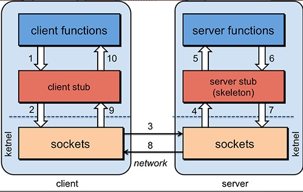

RPC的工作方式通常涉及两个主要角色：客户端和服务器。客户端发起一个请求，并通过网络发送到服务器端，服务器端接收到请求后执行相应的操作，然后将结果返回给客户端。客户端在接收到结果后继续执行其他操作。

更详细的说，客户端（client functions）调用自身的客户端桩（client stub）（代理客户端的角色），底层采用 socket 方式与远程服务端建立连接，然后服务端一方通过服务端桩（client stub）（代理服务端的角色），调用服务端（server functions）得到服务结果，并一路返回给客户端。

这个模型中特殊角色如下：

- 桩（stub）：作为客户端或服务端的代理角色，负责屏蔽底层通信过程。就像敲键盘一样，敲的字是如何显示在屏幕上的这个过程已经被屏蔽了，我们开箱即用即可。也正如我们学习 Java 一样，经常调用各种方法，如 System.out.println()，那么它的底层采用了什么机制才能在控制台显示数据，我们无需知道。这些底层实现已经被屏蔽了，正如桩这个角色的存在。
- 套接字（socket）：建立两台计算机之间通信的角色，双方各代表了一个套接字，双方通过这个套接字标识自己的身份，用于和对方进行通信。

上述只是一个 RPC 应有的过程，实际上，为了这个 RPC 的高可用等方面，需要做出很多其它方面的努力，比如经典的 Dubbo 架构图：

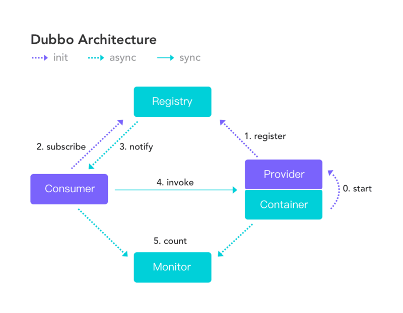

在 Dubbo 模型图中，Consumer 和 Provider 分别表示客户端和服务端，这个模型图提供了 Registry 服务注册中心，Monitor 监控中心来提高远程过程调用的高可用性，总而言之，Dubbo 是一个非常优秀的 RPC。

## RPC 版本

### v1 版本【请求与响应】

背景：Socket 编程

说明：RPC 本质上就是向远程服务端进行一次调用获取服务，要想实现这个，可以基于 TCP 进行连接。模拟客户端请求服务端调用方法的一次过程。

思路：客户端与服务端建立 TCP Socket 连接，模拟一次服务调用过程。

- 依赖：暂且引入两个依赖包，lombok 简化实体类代码，logback 用于日志输出

  ```xml
  <dependency>
      <groupId>org.projectlombok</groupId>
      <artifactId>lombok</artifactId>
      <version>1.18.28</version>
  </dependency>
  <!-- SLF4J API -->
  <dependency>
      <groupId>org.slf4j</groupId>
      <artifactId>slf4j-api</artifactId>
      <version>2.0.5</version>
  </dependency>
  <!-- logback 实现 -->
  <dependency>
      <groupId>ch.qos.logback</groupId>
      <artifactId>logback-classic</artifactId>
      <version>1.4.7</version>
  </dependency>
  ```

过程：

- （1）定义一个实体 `User` 表示服务的实体对象，实现 jdk 自带的 `Serializable` 接口进行序列化，以便网络中传输

  ```java
  @Data
  @Builder
  @NoArgsConstructor
  @AllArgsConstructor
  public class User implements Serializable {
      private String id;
      private String name;
  }
  ```

- （2）定义一个接口 `UserService` 表示服务接口

  ```java
  public interface UserService {
      User getUserById(String id);
  }
  ```

- （3）定义一个实现类 `UserServiceImpl` 实现服务

  ```java
  public class UserServiceImpl implements UserService {
      @Override
      public User getUserById(String id) {
          return User.builder().id(id).name("rpc").build();
      }
  }
  ```

- （4）实现一个服务端 `RPCServer`，等待客户端建立连接并调用服务返回结果

  ```java
  public class RPCServer {
      private static final Logger logger = LoggerFactory.getLogger(RPCServer.class);
      public static void main(String[] args) throws IOException {
          // 注册服务
          UserService userService = new UserServiceImpl();
          ServerSocket serverSocket = new ServerSocket(8888);
          try {
              logger.info("服务器启动成功...");
              // BIO 方式等待客户端连接
              while (true) {
                  // 进入阻塞，等待连接
                  Socket socket = serverSocket.accept();
                  logger.info("服务器连接成功：{}", socket);
                  // 开启线程去处理
                  new Thread(() -> {
                      try {
                          // 得到 IO 流
                          ObjectOutputStream oos = new ObjectOutputStream(socket.getOutputStream());
                          ObjectInputStream ois = new ObjectInputStream(socket.getInputStream());
                          // 读取数据
                          String id = String.valueOf(ois.readInt());
                          // 调用服务
                          User user = userService.getUserById(id);
                          // 返回结果
                          oos.writeObject(user);
                          oos.flush();
                          logger.info("服务器发送：{}", user);
                          // 关闭通道
                          oos.close();
                          ois.close();
                      } catch (IOException e) {
                          logger.info("客户端连接错误...");
                          throw new RuntimeException(e);
                      }
                  }).start();
              }
          } catch (IOException e) {
              logger.info("服务器启动失败...");
              throw new RuntimeException(e);
          }
      }
  }
  ```

- （5）实现一个客户端 `RPCClient`，建立服务端连接并接收结果

  ```java
  public class RPCClient {
      private static final Logger logger = LoggerFactory.getLogger(RPCClient.class);
      public static void main(String[] args) throws IOException, ClassNotFoundException {
          // 连接服务器
          Socket socket = new Socket(InetAddress.getLocalHost(), 8888);
          logger.info("客户端已经启动...");
          if (socket.isConnected()) {
              // 得到 IO 流
              ObjectOutputStream objectOutputStream = new ObjectOutputStream(socket.getOutputStream());
              ObjectInputStream objectInputStream = new ObjectInputStream(socket.getInputStream());
              // 传入数据
              objectOutputStream.writeInt(1);
              objectOutputStream.flush();
              // 得到数据
              User user = (User) objectInputStream.readObject();
              logger.info("客户端收到：{}", user);
              // 关闭 IO 流
              objectInputStream.close();
              objectOutputStream.close();
          }
          // 关闭连接
          socket.close();
      }
  }
  ```

结果：

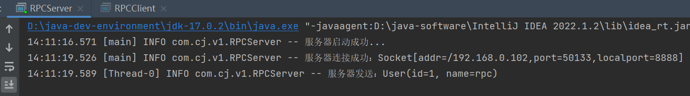

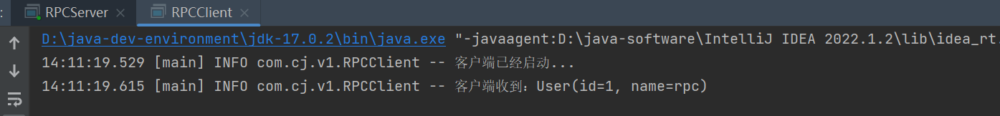

缺点：

- 客户端没有显示的指出哪个服务被调用，因此对于服务端来说这是非常糟糕的，服务端无法识别调用的服务，因此也就难以确定应该调用哪个服务结果并返回，因此需要对客户端发送的请求进行统一化，指定服务的相关信息，包括（接口名、方法名、参数类型、参数值），同样也需要服务端统一化相应结果，包括（响应码、响应消息、响应值）。

### v2 版本【请求、响应统一化】

说明：解决 v1 版本中的不足之处，并实现请求参数和响应结果的统一化。

思路：封装两个类 RPCRequest 和 RPCResponse 分别表示请求对象以及响应对象。

过程：

- （1）统一请求 `RPCRequest`

  ```java
  @Data
  @Builder
  public class RPCRequest implements Serializable {
      // 服务接口名
      private String interfaceName;
      // 服务方法名
      private String methodName;
      // 服务方法参数类型
      private Class<?>[] type;
      // 服务方法参数列表
      private Object[] args;
  }
  ```

- （2）统一响应 `RPCResponse`

  ```java
  @Data
  @Builder
  public class RPCResponse implements Serializable {
      // 响应状态码
      private Integer code;
      // 响应消息体
      private String message;
      // 响应数据
      private Object data;
  
      // 成功
      public static RPCResponse ok(Object data) {
          return RPCResponse.builder().code(200).message("success").data(data).build();
      }
      // 失败
      public static RPCResponse error() {
          return RPCResponse.builder().code(500).message("error").build();
      }
  }
  ```

- （3）拓展服务方法 `UserService`

  ```java
  public interface UserService {
      // 查询用户
      User getUserById(String id);
      // 更新用户名
      User updateUserName(String id, String name);
  }
  ```

- （4）实现服务方法 `UserServiceImpl`

  ```java
  public class UserServiceImpl implements UserService {
      @Override
      public User getUserById(String id) {
          return User.builder().id(id).name("rpc").build();
      }
  
      @Override
      public User updateUserName(String id, String name) {
          return User.builder().id(id).name(name).build();
      }
  }
  ```

- （5）服务端 `RPCServer` 利用反射解析客户端请求

  ```java
  import com.cj.v1.UserService;
  import com.cj.v1.UserServiceImpl;
  import org.slf4j.Logger;
  import org.slf4j.LoggerFactory;
  
  import java.io.IOException;
  import java.io.ObjectInputStream;
  import java.io.ObjectOutputStream;
  import java.lang.reflect.InvocationTargetException;
  import java.lang.reflect.Method;
  import java.net.ServerSocket;
  import java.net.Socket;
  
  public class RPCServer {
      private static final Logger logger = LoggerFactory.getLogger(RPCServer.class);
      public static void main(String[] args) throws IOException {
          // 注册服务
          UserService userService = new UserServiceImpl();
          ServerSocket serverSocket = new ServerSocket(8888);
          try {
              logger.info("服务器启动成功...");
              // BIO 方式等待客户端连接
              while (true) {
                  // 进入阻塞，等待连接
                  Socket socket = serverSocket.accept();
                  logger.info("服务器连接成功：{}", socket);
                  // 开启线程去处理
                  new Thread(() -> {
                      try {
                          // 得到 IO 流
                          ObjectOutputStream oos = new ObjectOutputStream(socket.getOutputStream());
                          ObjectInputStream ois = new ObjectInputStream(socket.getInputStream());
  
                          **// 请求对象
                          RPCRequest request = (RPCRequest) ois.readObject();
                          // 反射调用方法
                          Method method = userService.getClass().getMethod(request.getMethodName(), request.getArgsTypes());
                          Object obj = method.invoke(userService, request.getArgs());
                          // 封装结果
                          RPCResponse response = RPCResponse.ok(obj);
                          // 响应结果
                          oos.writeObject(response);**
  
                          oos.flush();
                          logger.info("服务器发送：{}", response);
                          // 关闭通道
                          oos.close();
                          ois.close();
                      } catch (IOException | ClassNotFoundException e) {
                          logger.info("客户端连接错误...");
                          throw new RuntimeException(e);
                      } catch (NoSuchMethodException | IllegalAccessException | InvocationTargetException e) {
                          throw new RuntimeException(e);
                      }
                  }).start();
              }
          } catch (IOException e) {
              logger.info("服务器启动失败...");
              throw new RuntimeException(e);
          }
      }
  }
  ```

- （6）客户端 `RPCClient` 构造请求

  ```java
  public class RPCClient {
      private static final Logger logger = LoggerFactory.getLogger(RPCClient.class);
      public static void main(String[] args) throws IOException, ClassNotFoundException, NoSuchMethodException {
          // 连接服务器
          Socket socket = new Socket(InetAddress.getLocalHost(), 8888);
          logger.info("客户端已经启动...");
          if (socket.isConnected()) {
              // 得到 IO 流
              ObjectOutputStream objectOutputStream = new ObjectOutputStream(socket.getOutputStream());
              ObjectInputStream objectInputStream = new ObjectInputStream(socket.getInputStream());
  
              **// 构造请求
              RPCRequest request = RPCRequest.builder()
                      .interfaceName(UserService.class.getName())
                      .methodName(UserService.class.getDeclaredMethod("updateUserName", String.class, String.class).getName())
                      .args(new Object[]{"1", "v2 rpc"})
                      .argsTypes(new Class[]{String.class, String.class})
                      .build();
              // 传入请求
              objectOutputStream.writeObject(request);
              objectOutputStream.flush();
              // 得到数据
              RPCResponse response = (RPCResponse) objectInputStream.readObject();
              logger.info("客户端收到：{}", response);**
  
              // 关闭 IO 流
              objectInputStream.close();
              objectOutputStream.close();
          }
          // 关闭连接
          socket.close();
      }
  }
  ```

结果：

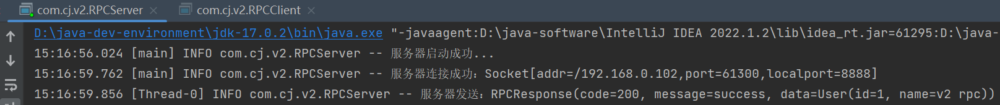

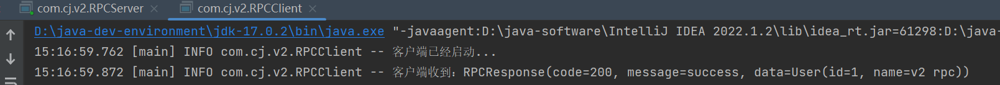

缺点：

- 客户端想要调用服务端的服务，需要知道太多底层网络通信细节，并且还需要手动构造请求体，这对客户端来说是非常麻烦的，因此我们需要对底层的通信进行封装，并通过动态代理来代理客户端进行服务的调用。

### v3 版本【动态代理屏蔽通信细节】

背景：动态代理

说明：屏蔽掉底层的通信细节，实现透明的分布式服务调用

过程：

- （1）新增 `RPCClientTransport`，处理客户端底层通信细节

  ```java
  public class RPCClientTransport {
      private static final Logger logger = LoggerFactory.getLogger(RPCClientTransport.class);
      // 向指定的主机、端口号，发送请求
      public static RPCResponse sendRPCRequest(String host, int post, RPCRequest request) {
          try {
              // 连接服务器
              Socket socket = new Socket(host, post);
              logger.info("客户端已经启动...");
              if (socket.isConnected()) {
                  // 得到 IO 流
                  ObjectOutputStream objectOutputStream = new ObjectOutputStream(socket.getOutputStream());
                  ObjectInputStream objectInputStream = new ObjectInputStream(socket.getInputStream());
  
                  // 传入请求
                  objectOutputStream.writeObject(request);
                  objectOutputStream.flush();
                  // 得到数据
                  RPCResponse response = (RPCResponse) objectInputStream.readObject();
                  logger.info("客户端收到：{}", response);
  
                  // 关闭 IO 流
                  objectInputStream.close();
                  objectOutputStream.close();
  
                  // 返回请求
                  return response;
              }
              // 关闭连接
              socket.close();
          } catch (IOException | ClassNotFoundException e) {
              throw new RuntimeException(e);
          }
          return null;
      }
  }
  ```

- （2）新增 `RPCClientProxy` ，代理客户端请求

  ```java
  @AllArgsConstructor
  public class RPCClientProxy implements InvocationHandler {
      private String host;
      private int port;
  
      @Override
      public Object invoke(Object proxy, Method method, Object[] args) throws Throwable {
          // 构建请求
          RPCRequest request = RPCRequest.builder()
                  .interfaceName(method.getDeclaringClass().getName())
                  .methodName(method.getName())
                  .args(args)
                  .argsTypes(method.getParameterTypes())
                  .build();
          // 发送请求
          RPCResponse response = RPCClientTransport.sendRPCRequest(host, port, request);
          // 返回数据
          return response.getData();
      }
  
  		public <T>T getServiceProxy(Class<T> clazz) {
          return (T) Proxy.newProxyInstance(
                  clazz.getClassLoader(), 
                  new Class[]{clazz}, 
                  this);
      }
  }
  ```

- （3）修改 `RPCClient`，实现代理类的代理

  ```java
  public class RPCClient {
      private static final Logger logger = LoggerFactory.getLogger(RPCClient.class);
      public static void main(String[] args) {
          // 生成客户端代理类
          RPCClientProxy rpcClientProxy = new RPCClientProxy("127.0.0.1",8888);
          // 代理具体服务
          UserService userService = rpcClientProxy.getServiceProxy(UserService.class);
  
          // 执行服务方法
          User user1 = userService.getUserById("1");
          logger.info("user1: {}", user1);
  
          User user2 = userService.updateUserName("1", "v3 rpc");
          logger.info("user2: {}", user2);
      }
  }
  ```

效果：

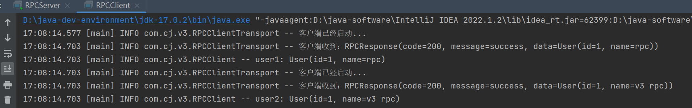

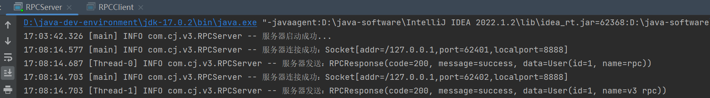

缺点：

- 服务端只能提供一种服务，如何提升多种服务呢。

### v4 版本【服务端提供多服务】

说明：为服务端提供多种服务。

过程：

- （1）新增一个服务 `BookService`

  ```java
  @Data
  @Builder
  @NoArgsConstructor
  @AllArgsConstructor
  public class Book implements Serializable {
      private String id;
      private String name;
      private double price;
      private boolean isBorrow;
  }
  
  public interface BookService {
      Book getBook(String id);
      boolean deleteBook(String id);
  }
  
  public class BookServiceImpl implements BookService {
  
      @Override
      public Book getBook(String id) {
          return Book.builder().id(id).name("java开发").price(39.9).build();
      }
  
      @Override
      public boolean deleteBook(String id) {
          return true;
      }
  }
  ```

- （2）新增一个服务提供者 `ServiceProvider` 和一个默认实现类 `DefaultServiceProvider`

  ```java
  public interface ServiceProvider {
  
      void addService(String serviceName, Object service);
  
      Object getService(String serviceName);
  
      void delService(String serviceName);
  }
  
  public class DefaultServiceProvider implements ServiceProvider {
      private Map<String, Object> services;
  
      public DefaultServiceProvider() {
          this.services = new HashMap<>();
      }
  
      @Override
      public void addService(String serviceName, Object service) {
          services.put(serviceName, service);
      }
  
      @Override
      public Object getService(String serviceName) {
          return services.get(serviceName);
      }
  
      @Override
      public void delService(String serviceName) {
          services.remove(serviceName);
      }
  }
  ```

- （3）更新 `RPCServer`

  ```java
  public class RPCServer {
      private static final Logger logger = LoggerFactory.getLogger(RPCServer.class);
      public static void main(String[] args) throws IOException {
          **// 注册服务
          UserService userService = new UserServiceImpl();
          BookService bookService = new BookServiceImpl();
          // 存储服务
          ServiceProvider serviceProvider = new DefaultServiceProvider();
          serviceProvider.addService(userService.getClass().getName(), userService);
          serviceProvider.addService(userService.getClass().getName(), bookService);**
  
          ServerSocket serverSocket = new ServerSocket(8888);
          try {
              logger.info("服务器启动成功...");
              // BIO 方式等待客户端连接
              while (true) {
                  // 进入阻塞，等待连接
                  Socket socket = serverSocket.accept();
                  logger.info("服务器连接成功：{}", socket);
                  // 开启线程去处理
                  new Thread(() -> {
                      try {
                          // 得到 IO 流
                          ObjectOutputStream oos = new ObjectOutputStream(socket.getOutputStream());
                          ObjectInputStream ois = new ObjectInputStream(socket.getInputStream());
                          // 请求对象
                          RPCRequest request = (RPCRequest) ois.readObject();
  
                          **// 得到服务名
                          String serviceName = request.getInterfaceName();
                          // 得到服务实现类
                          Object service = serviceProvider.getService(serviceName);
                          // 得到服务方法并调用
                          Method method = service.getClass().getMethod(request.getMethodName(), request.getArgsTypes());
                          Object obj = method.invoke(service, request.getArgs());**
  
                          // 封装结果
                          RPCResponse response = RPCResponse.ok(obj);
                          // 响应结果
                          oos.writeObject(response);
                          oos.flush();
                          logger.info("服务器发送：{}", response);
                          // 关闭通道
                          oos.close();
                          ois.close();
                      } catch (IOException | ClassNotFoundException e) {
                          logger.info("客户端连接错误...");
                          throw new RuntimeException(e);
                      } catch (NoSuchMethodException | IllegalAccessException | InvocationTargetException e) {
                          throw new RuntimeException(e);
                      }
                  }).start();
              }
          } catch (IOException e) {
              logger.info("服务器启动失败...");
              throw new RuntimeException(e);
          }
      }
  }
  ```

- （4）更新 `RPCClient`

  ```java
  public class RPCClient {
      private static final Logger logger = LoggerFactory.getLogger(RPCClient.class);
      public static void main(String[] args) {
          // 生成客户端代理类
          RPCClientProxy rpcClientProxy = new RPCClientProxy("127.0.0.1",8888);
  
          // 代理 user 服务
          UserService userService = rpcClientProxy.getProxyService(UserService.class);
          User user = userService.getUser("1");
          logger.info("user: {}", user);
  
          // 代理 book 服务
          BookService bookService = rpcClientProxy.getProxyService(BookService.class);
          Book book = bookService.getBook("1");
          logger.info("book: {}", book);
      }
  }
  ```

效果：

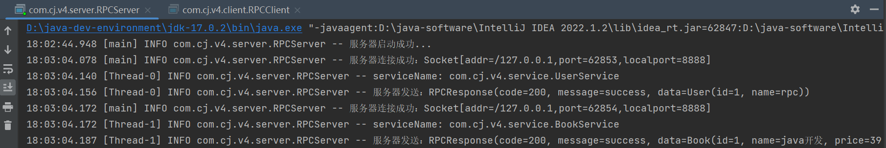

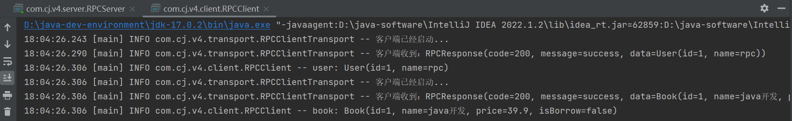

优点：

- 服务端只能通过单线程的方式进行处理请求，过于单一
- 服务端的代码过于耦合，职责不清晰

### v5 版本【提供多种服务端】

说明：抽象化服务端的存在，将其功能进行多种化。

实现：

- （1）重构 `RPCServer` 作为抽象类 `AbstractRPCServer` 存在

  ```java
  @AllArgsConstructor
  @Data
  public abstract class AbstractRPCServer {
      private int port;
  
      private ServiceProvider serviceProvider;
      public abstract void startServer();
      public abstract void stopServer();
  }
  ```

- （2）新增 `SingleThreadBIORPCServer`，实现单线程下的 BIO 服务提供

  ```java
  public class SingleThreadBIOServer extends AbstractRPCServer {
      // 服务提供商
  
      private static final Logger logger = LoggerFactory.getLogger(SingleThreadBIOServer.class);
  
      public SingleThreadBIOServer(int port, ServiceProvider serviceProvider) {
          super(port, serviceProvider);
      }
  
      @Override
      public void startServer() {
          try {
              ServerSocket serverSocket = new ServerSocket(getPort());
              logger.info("服务器启动成功...");
              // BIO 方式等待客户端连接
              while (true) {
                  // 进入阻塞，等待连接
                  Socket socket = serverSocket.accept();
                  logger.info("服务器连接成功：{}", socket);
                  // 开启线程去处理
                  new Thread(new BIOThreadHandler(socket, getServiceProvider())).start();
              }
          } catch (IOException e) {
              logger.info("服务器启动失败...");
              throw new RuntimeException(e);
          }
      }
  
      @Override
      public void stopServer() {
  
      }
  }
  ```

- （3）新增 `ThreadPoolBIORPCServer`，实现多线程下的 BIO 服务提供

  ```java
  public class ThreadPoolBIOServer extends AbstractRPCServer {
      // 服务提供商
      private final ThreadPoolExecutor threadPool;
      private static final Logger logger = LoggerFactory.getLogger(ThreadPoolBIOServer.class);
  
      public ThreadPoolBIOServer(int port, ServiceProvider serviceProvider) {
          super(port, serviceProvider);
          this.threadPool = new ThreadPoolExecutor(Runtime.getRuntime().availableProcessors(),
                  1000, 60, TimeUnit.SECONDS, new ArrayBlockingQueue<>(100));
      }
      public ThreadPoolBIOServer(int port, ServiceProvider serviceProvider, ThreadPoolExecutor threadPool) {
          super(port, serviceProvider);
          this.threadPool = threadPool;
      }
  
      @Override
      public void startServer() {
          try {
              ServerSocket serverSocket = new ServerSocket(getPort());
              logger.info("服务器启动成功...");
              // BIO 方式等待客户端连接
              while (true) {
                  // 进入阻塞，等待连接
                  Socket socket = serverSocket.accept();
                  logger.info("服务器连接成功：{}", socket);
                  // 开启线程去处理
                  threadPool.execute(new BIOThreadHandler(socket, getServiceProvider()));
              }
          } catch (IOException e) {
              logger.info("服务器启动失败...");
              throw new RuntimeException(e);
          }
      }
  
      @Override
      public void stopServer() {
  
      }
  }
  ```

- （4）新增 `BIOThreadHandler`，处理线程操作

  ```java
  @AllArgsConstructor
  public class BIOThreadHandler implements Runnable {
  
      private static final Logger logger = LoggerFactory.getLogger(BIOThreadHandler.class);
  
      private Socket socket;
      private ServiceProvider serviceProvider;
      @Override
      public void run() {
          try {
              // 得到 IO 流
              ObjectOutputStream oos = new ObjectOutputStream(socket.getOutputStream());
              ObjectInputStream ois = new ObjectInputStream(socket.getInputStream());
              // 请求对象
              RPCRequest request = (RPCRequest) ois.readObject();
              // 得到服务名
              String serviceName = request.getInterfaceName();
              logger.info("服务名: {}", serviceName);
              // 得到服务实现类
              Object service = serviceProvider.getService(serviceName);
              // 得到服务方法并调用
              Method method = service.getClass().getMethod(request.getMethodName(), request.getArgsTypes());
              Object obj = method.invoke(service, request.getArgs());
              // 封装结果
              RPCResponse response = RPCResponse.ok(obj);
              // 响应结果
              oos.writeObject(response);
              oos.flush();
              logger.info("服务器发送：{}", response);
              // 关闭通道
              oos.close();
              ois.close();
          } catch (IOException | ClassNotFoundException | NoSuchMethodException | IllegalAccessException |
                   InvocationTargetException e) {
              throw new RuntimeException(e);
          }
      }
  }
  ```

- （5）新增 `Server` 作为测试服务端

  ```java
  public class Server {
      public static void main(String[] args) {
          // 注册服务
          UserService userService = new UserServiceImpl();
          BookService bookService = new BookServiceImpl();
          // 存储服务
          ServiceProvider serviceProvider = new DefaultServiceProvider();
          serviceProvider.addService(userService.getClass().getInterfaces()[0].getName(), userService);
          serviceProvider.addService(bookService.getClass().getInterfaces()[0].getName(), bookService);
          // 测试服务
          AbstractRPCServer abstractRpcServer = new SingleThreadBIOServer(8888, serviceProvider);
          abstractRpcServer.startServer();
      }
  }
  ```

结果：

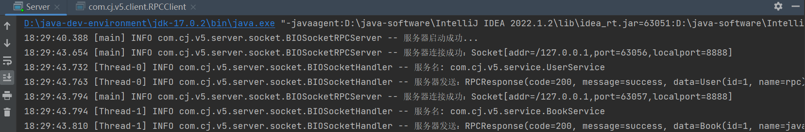

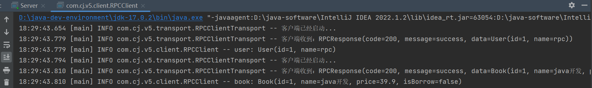

缺点：

- 客户端具有唯一实现，无法支持多种客户端类型，可拓展性较差

### v6 版本【提供多种客户端】

说明：为客户端保留接口，方便后续补充更多种客户端类型。

实现：

- （1）重构 `RPCClient`，使其为抽象类 `AbstarctRPCClient`，不同的子类实现不同的发送请求方式

  ```java
  @AllArgsConstructor
  @Data
  public abstract class AbstractRPCClient {
      private String host;
      private int port;
      public abstract RPCResponse sendRPCRequest(RPCRequest request);
  }
  ```

- （2）提供默认的客户端方式 `DefaultRPCClient`（把 `RPCClientTransport` 代码搬过来）

  ```java
  public class DefaultRPCClient extends AbstractRPCClient {
      private static final Logger logger = LoggerFactory.getLogger(DefaultRPCClient.class);
  
      public DefaultRPCClient(String host, int port) {
          super(host, port);
      }
  
      @Override
      public RPCResponse sendRPCRequest(RPCRequest request) {
          try {
              // 连接服务器
              Socket socket = new Socket(getHost(), getPort());
              logger.info("客户端已经启动...");
              if (socket.isConnected()) {
                  // 得到 IO 流
                  ObjectOutputStream objectOutputStream = new ObjectOutputStream(socket.getOutputStream());
                  ObjectInputStream objectInputStream = new ObjectInputStream(socket.getInputStream());
  
                  // 传入请求
                  objectOutputStream.writeObject(request);
                  objectOutputStream.flush();
                  // 得到数据
                  RPCResponse response = (RPCResponse) objectInputStream.readObject();
                  logger.info("客户端收到：{}", response);
  
                  // 关闭 IO 流
                  objectInputStream.close();
                  objectOutputStream.close();
  
                  // 返回请求
                  return response;
              }
              // 关闭连接
              socket.close();
          } catch (IOException | ClassNotFoundException e) {
              throw new RuntimeException(e);
          }
          return null;
      }
  }
  ```

- （3）重构代理类 `RPCClientProxy`

  ```java
  @AllArgsConstructor
  public class RPCClientProxy implements InvocationHandler {
      private AbstractRPCClient abstractRpcClient;
      @Override
      public Object invoke(Object proxy, Method method, Object[] args) throws Throwable {
          // 构建请求
          RPCRequest request = RPCRequest.builder()
                  .interfaceName(method.getDeclaringClass().getName())
                  .methodName(method.getName())
                  .args(args)
                  .argsTypes(method.getParameterTypes())
                  .build();
          // 发送请求
          RPCResponse response = abstractRpcClient.sendRPCRequest(request);
          // 返回数据
          return response.getData();
      }
  
      public <T>T getProxyService(Class<T> clazz) {
          return (T) Proxy.newProxyInstance(
                  clazz.getClassLoader(),
                  new Class[]{clazz},
                  this);
      }
  }
  ```

- （4）新增客户端测试类

  ```java
  public class Client {
      private static final Logger logger = LoggerFactory.getLogger(Client.class);
  
      public static void main(String[] args) {
          AbstractRPCClient abstractRpcClient = new DefaultRPCClient("127.0.0.1",8888);
          // 生成客户端代理类
          RPCClientProxy rpcClientProxy = new RPCClientProxy(abstractRpcClient);
  
          // 代理 user 服务
          UserService userService = rpcClientProxy.getProxyService(UserService.class);
          User user = userService.getUser("1");
          logger.info("user: {}", user);
  
          // 代理 book 服务
          BookService bookService = rpcClientProxy.getProxyService(BookService.class);
          Book book = bookService.getBook("1");
          logger.info("book: {}", book);
      }
  }
  ```

效果：

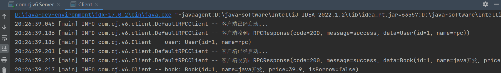

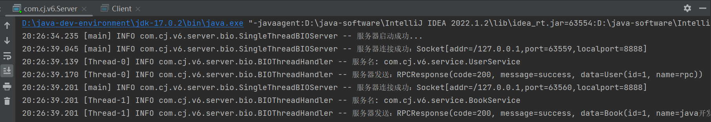

缺点：

- BIO 性能比较低，因为它一直阻塞着程序运行，浪费资源，并且它需要额外的线程去处理请求，较大线程开销。

### v7 版本【提供 Netty 版本的客户端、服务端】

背景：BIO、NIO、Netty

说明：NIO 相对于 BIO 进行了改进，如非阻塞模型 + Selector 模型，这就使得 NIO 能够以较少的线程来响应更多的请求，减少了相对于 BIO 存在的线程管理的开销。但是为什么使用 Netty 而不是 NIO 呢？这里给出几点理由：

1. **简单易用**：原生 NIO 存在编程复杂的问题，而 Netty 对底层通信细节进行了抽象和封装，使得开发人员只需要更加专注于业务而非底层。
2. **可拓展性**：首先对于一个项目来说，可拓展性是衡量项目能否长远发展的指标，NIO 相较于 Netty 存在天然的拓展性差的劣势，就像为什么使用 SpringBoot 进行项目开发而不使用纯 Java，Netty 不仅支持 NIO 存在的非阻塞模型，还支持其它模型。
3. **功能支持**：Netty 相对于 NIO 提供了丰富的编解码器和协议支持，可以轻松处理各种数据格式和协议。
4. **异常处理**：Netty 提供了更多的异常处理机制，通过 ChannelHandler，可以很方便的处理各种异常，比如连接断开、超时等，此外，Netty 还支持心跳检测、断线重连等功能，增强了应用程序的可靠性和稳定性

依赖：

```xml
<dependency>
    <groupId>io.netty</groupId>
    <artifactId>netty-all</artifactId>
    <version>4.1.94.Final</version>
</dependency>
```

过程：

- （1）新增 `NettyRPCServer`

  ```java
  public class NettyRPCServer extends AbstractRPCServer {
  
      private static final Logger logger = LoggerFactory.getLogger(NettyRPCServer.class);
  
      public NettyRPCServer(int port, ServiceProvider serviceProvider) {
          super(port, serviceProvider);
      }
  
      @Override
      public void startServer() {
          new ServerBootstrap()
                  .group(new NioEventLoopGroup())
                  .channel(NioServerSocketChannel.class)
                  .childHandler(new ChannelInitializer<NioSocketChannel>() {
                      @Override
                      protected void initChannel(NioSocketChannel nioSocketChannel) throws Exception {
                          // jdk 解码器
                          nioSocketChannel.pipeline().addLast(new ObjectDecoder(Class::forName));
                          // 管道数据处理器（rpcRequest）
                          nioSocketChannel.pipeline().addLast(new NettyRPCServerHandler(getServiceProvider()));
                          // jdk 编码器
                          nioSocketChannel.pipeline().addLast(new ObjectEncoder());
                      }
                  })
                  .bind(getPort());
          logger.info("Netty 服务端等待连接...");
      }
  
      @Override
      public void stopServer() {
  
      }
  }
  ```

- （2）新增 `NettyRPCServerHandler` 入站处理器，处理接收到的请求 `RPCRequest`

  ```java
  @AllArgsConstructor
  public class NettyRPCServerHandler extends SimpleChannelInboundHandler<RPCRequest> {
  
      private ServiceProvider serviceProvider;
      private static final Logger logger = LoggerFactory.getLogger(NettyRPCServerHandler.class);
  
      @Override
      protected void channelRead0(ChannelHandlerContext channelHandlerContext, RPCRequest rpcRequest) throws Exception {
          try {
              logger.info("Netty 服务端接收: 【{}】", rpcRequest);
              // 得到服务名
              String serviceName = rpcRequest.getInterfaceName();
              // 得到服务实现类
              Object service = serviceProvider.getService(serviceName);
              // 反射调用方法
              Method method = service.getClass().getMethod(rpcRequest.getMethodName(), rpcRequest.getArgsTypes());
              Object obj = method.invoke(service, rpcRequest.getArgs());
              // 封装结果
              RPCResponse response = RPCResponse.ok(obj);
              // 写入管道
              Channel channel = channelHandlerContext.channel();
              channel.writeAndFlush(response);
              logger.info("Netty 服务端发送：【{}】", response);
          } catch (NoSuchMethodException | IllegalAccessException | InvocationTargetException e) {
              e.printStackTrace();
          }
      }
  }
  ```

- （3）新增 `NettyRPCClient`

  ```java
  public class NettyRPCClient extends AbstractRPCClient {
      private static final Logger logger = LoggerFactory.getLogger(NettyRPCClient.class);
      public NettyRPCClient(String host, int port) {
          super(host, port);
      }
  
      @Override
      public RPCResponse sendRPCRequest(RPCRequest request) {
          CompletableFuture<RPCResponse> completableFuture = new CompletableFuture<>();
          ChannelFuture channelFuture = new Bootstrap()
                  .group(new NioEventLoopGroup())
                  .channel(NioSocketChannel.class)
                  .handler(new ChannelInitializer<NioSocketChannel>() {
                      @Override
                      protected void initChannel(NioSocketChannel nioSocketChannel) throws Exception {
                          // 解码器
                          nioSocketChannel.pipeline().addLast(new ObjectDecoder(Class::forName));
                          // 入站处理器
                          nioSocketChannel.pipeline().addLast(new NettyRPCClientHandler(completableFuture));
                          // 编码器
                          nioSocketChannel.pipeline().addLast(new ObjectEncoder());
                      }
                  })
                  .connect(new InetSocketAddress(getHost(), getPort()));
          try {
              // 同步阻塞，直到连接建立完成发送结果
              channelFuture.sync();
              logger.info("Netty 客户端连接建立成功...");
              Channel channel = channelFuture.channel();
              channel.writeAndFlush(request);
              logger.info("Netty 客户端发送：【{}】", request);
              // 异步获取处理结果
              return completableFuture.get();
          } catch (InterruptedException | ExecutionException e) {
              throw new RuntimeException(e);
          }
      }
  }
  ```

- （4）新增 `NettyRPCClientHandler` 入站处理器，处理接收到的响应 `RPCResponse`

  ```java
  @AllArgsConstructor
  public class NettyRPCClientHandler extends SimpleChannelInboundHandler<RPCResponse> {
      private CompletableFuture<RPCResponse> completableFuture;
      private static final Logger logger = LoggerFactory.getLogger(NettyRPCClientHandler.class);
      @Override
      protected void channelRead0(ChannelHandlerContext channelHandlerContext, RPCResponse rpcResponse) {
          logger.info("Netty 客户端接收: 【{}】", rpcResponse);
          completableFuture.complete(rpcResponse);
      }
  }
  ```

- （5）修改 `Client`、`Server`

  ```java
  // Client
  AbstractRPCClient abstractRpcClient = new DefaultRPCClient("127.0.0.1",8888); 
  // 改成下面这句
  AbstractRPCClient abstractRpcClient = new NettyRPCClient("127.0.0.1",8888);
  
  // Server
  AbstractRPCServer abstractRpcServer = new SingleThreadBIOServer(8888, serviceProvider);
  // 改成下面这句
  AbstractRPCServer abstractRpcServer = new NettyRPCServer(8888, serviceProvider);
  ```

效果：

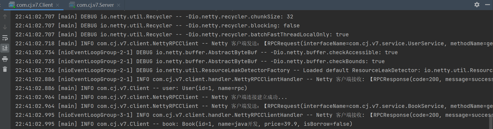

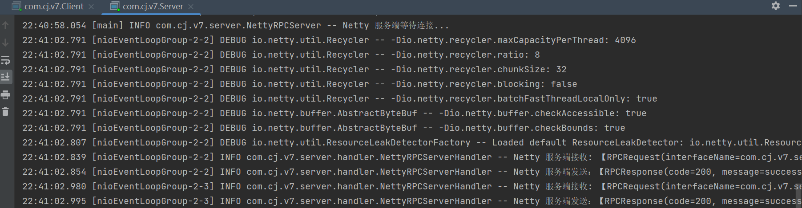

缺点：

- 在上面的过程中，我们使用了 Java 自带的原生序列化方式，这种序列化方式会把对象类的描述信息和所有的属性以及继承的元数据都序列化为字节流，导致生成的字节流相对比较大，占用更多网络带宽，并且不支持跨语言。

- 而且 java 的编码器、解码器都已经不推荐使用了，我们可以采用 Netty 提供的一些编、解码器进行编码和解码工作，我们也可以自己定义一套编、解码器。

  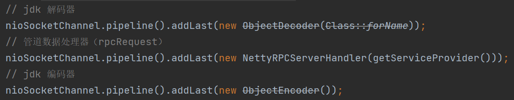

> 附：Netty 的日志有点耗费眼睛，我们可以关闭它，比如 logback 日志，那么在 resources 目录下配置 logback.xml 如下所示：
>
> - logback.xml 配置文件
>
>   ```java
>   <configuration>
>       <appender name="CONSOLE" class="ch.qos.logback.core.ConsoleAppender">
>           <encoder>
>               <pattern>%date{HH:mm:ss.SSS} [%thread] %-5level %logger{36} -- %msg%n</pattern>
>           </encoder>
>       </appender>
>       
>       <root level="info">
>           <appender-ref ref="CONSOLE" />
>       </root>
>       
>       <!-- 设置Netty的日志级别为INFO -->
>       <logger name="io.netty" level="INFO" />
>   </configuration>
>   ```

### v8 版本【自定义通信协议、编解码器、序列化方式】

背景

- 通信协议
- Netty 的编码器、解码器
- 各种序列化的应用（jdk、json、kryo）

说明：开发一套编解码器以供编码、解码使用，应对不同的序列化方式。

如果我们采用自定义的编解码器的方式处理传输数据，那么传输过程中的数据必定要符合我们的格式才能进行编码、解码工作，例如 TCP 传输过程中是以 TCP 报文的形式进行传输的，TCP 报文上带有各种字段，接收方通过解析这些字段，就能知道这个 TCP 报文是发送给自己的，并且还能获取 TCP 报文中的数据。

基于网路通信协议的设计思想，我们也需要制定出一个自身的通信协议来进行网络间的通信，保证通信双方能够完成正常的通信。

- Json 序列化和反序列化过程中的两个问题

  1. `not support ClassForName : java.lang.String, you can config 'JSONReader.Feature.SupportClassForName'`

     这是因为 fastjson 默认不支持有 Class 的参数类型，可以在反序列化时配置 `JSONReader.Feature.SupportClassForName` 解决。

  2. `class com.alibaba.fastjson2.JSONObject cannot be cast to class com.cj.v8.pojo.User`

     我们的 RPCResponse 中嵌套了 Object 类型的对象，而我们传的对象可能是多种，如 User、Book，为了解决它能够自动的进行类型匹配

     - 在序列化时加上类型信息 `JSONWriter.Feature.*WriteClassName*`
     - 反序列化时加上自动匹配 `JSONReader.Feature.*SupportAutoType*`

- Kryo 序列化的版本问题

  5.5.0、5.4.0、5.2.0 版本都有问题，使用 writeObject() 方法会阻塞住（可能 5.x 版本都这样）。改用 4.0.2 版本即可。

通信协议设计如下：

```java
/**
 *  0   1   2   3   4         5         6   7   8   9   10        11    12    13   14   15          16
 *  +--------------------------------------------------------------------------------------------- --+
 *  |      魔数     | 版本号  |序列化算法 | 消息号         | 消息类型 |      消息总长       | 保留字段   |
 *  |     4byte     | 1byte  | 1byte    |  4byte         | 1byte   |      4byte          | 1byte     |
 *  +------------------------------------------------------------------------------------------------+
 *  |                                    数据内容 （长度不定）                                         |
 *  |                                                                                                |
 *  +------------------------------------------------------------------------------------------------+
 */
```

实现：

- （1）新增 `RPCMessage` 对象，统一表示通信过程中传输的对象

  ```java
  @Data
  @Builder
  public class RPCMessage {
      private int magicNum;       // 魔数
      private byte version;       // 版本号
      private byte serializeTpe;  // 序列化算法
      private int messageId;      // 消息号
      private byte messageType;   // 消息类型
      private int messageLength;  // 消息总长
      private byte reserve;       // 保留字段
      private Object data;        // 消息数据
  }
  ```

- （2）新增 `Serializer` 接口，用于拓展多种序列化方式

  ```java
  public interface Serializer {
      // 序列化方法：把对象转成字节数组
      <T> byte[] serialize(T object);
      // 反序列化方法：把字节数组转成对象
      <T> T deserialize(Class<T> clazz, byte[] bytes);
  }
  ```

- （3）新增 `JdkSerializer` 实现类，实现了 Jdk 版本的序列化方式

  ```java
  public class JdkSerializer implements Serializer {
  
      @Override
      public <T> byte[] serialize(T object) {
          byte[] bytes = null;
          try {
              ByteArrayOutputStream bos = new ByteArrayOutputStream();
              ObjectOutputStream oos = new ObjectOutputStream(bos);
              oos.writeObject(object);
              oos.flush();
              bytes = bos.toByteArray();
              oos.close();
              bos.close();
          } catch (IOException e) {
              e.printStackTrace();
          }
          return bytes;
      }
  
      @Override
      public <T> T deserialize(Class<T> clazz, byte[] bytes) {
          Object obj = null;
          try {
              ByteArrayInputStream bis = new ByteArrayInputStream(bytes);
              ObjectInputStream ois = new ObjectInputStream(bis);
              obj = ois.readObject();
              ois.close();
              bis.close();
          } catch (ClassNotFoundException | IOException e) {
              throw new RuntimeException(e);
          }
          return clazz.cast(obj);
      }
  }
  ```

- （4）新增 `JsonSerializer` 实现类，实现了 Json 版本的序列化方式（注意嵌套）

  ```java
  public class JsonSerializer implements Serializer {
      private static final Logger logger = LoggerFactory.getLogger(JsonSerializer.class);
  
      @Override
      public <T> byte[] serialize(T object) {
          return JSON.toJSONString(object, JSONWriter.Feature.WriteClassName).getBytes();
      }
      @Override
      public <T> T deserialize(Class<T> clazz, byte[] bytes) {
          // 1. JSONReader.Feature.SupportClassForName
          // 错误原因：not support ClassForName : java.lang.String, you can config 'JSONReader.Feature.SupportClassForName'
          // 解决 Class<?> 参数类型时出现的问题
          // 2. JSONReader.Feature.SupportAutoType + JSONWriter.Feature.WriteClassName
          // 错误原因：class com.alibaba.fastjson2.JSONObject cannot be cast to class com.cj.v8.pojo.User
          // 解决子属性中是未知 Object 类型的问题
          return JSON.parseObject(bytes, clazz, JSONReader.Feature.SupportClassForName, JSONReader.Feature.SupportAutoType);
      }
  }
  ```

- （5）新增 `KryoSerializer` 实现类，实现了 Kryo 版本的序列化方式（注意导入的版本号）

  ```java
  public class KryoSerializer implements Serializer {
      private static final Kryo kryo = new Kryo();
  
      static {
          kryo.register(RPCRequest.class);
          kryo.register(RPCMessage.class);
      }
      @Override
      public <T> byte[] serialize(T object) {
          try(ByteArrayOutputStream byteArrayOutputStream = new ByteArrayOutputStream();
              Output output = new Output(byteArrayOutputStream)) {
              kryo.writeObject(output, object);
              return output.toBytes();
          } catch (IOException e) {
              throw new RuntimeException(e);
          }
      }
  
      @Override
      public <T> T deserialize(Class<T> clazz, byte[] bytes) {
          try(ByteArrayInputStream byteArrayInputStream = new ByteArrayInputStream(bytes);
              Input input = new Input(byteArrayInputStream)) {
              T t = kryo.readObject(input, clazz);
              return clazz.cast(t);
          } catch (IOException e) {
              throw new RuntimeException(e);
          }
      }
  }
  ```

- （6）新增 `RPCConstant` 常量池，定义了多种常量类型

  ```java
  public interface RPCConstant {
  
      int MESSAGE_MAGIC_NUM = "QRPC".hashCode();
      int MESSAGE_HEADER_LENGTH = 16;
      byte MESSAGE_VERSION = 1;
      byte MESSAGE_RESERVE = 0;
  
      byte MESSAGE_TYPE_REQUEST = 0;
      byte MESSAGE_TYPE_RESPONSE = 1;
  
      byte MESSAGE_SERIALIZE_JDK = 0;
      byte MESSAGE_SERIALIZE_JSON = 1;
  		byte MESSAGE_SERIALIZE_KRYO = 2;
  
  }
  ```

- （7）新增 `SerializerUtil` 工具类，用于根据序列化类型的值获取序列化类

  ```java
  public class SerializerUtil {
      public static Serializer getSerializer(byte serializeType) {
          switch (serializeType) {
              case 0:
                  return new JdkSerializer();
              case 1:
                  return new JsonSerializer();
              case 2:
                  return new KryoSerializer();
              default:
                  return null;
          }
      }
  }
  ```

- （8）新增 `MessageUtil` 工具类，用于根据消息类型的值获取消息类

  ```java
  public class MessageUtil {
  
      public static Class getMessage(byte messageType) {
          switch (messageType) {
              case 0:
                  return RPCRequest.class;
              case 1:
                  return RPCResponse.class;
              default:
                  return null;
          }
      }
  }
  ```

- （9）新增 `RPCEncoder` 编码器，用于对消息进行编码

  ```java
  public class RPCEncoder extends MessageToByteEncoder<RPCMessage> {
  
      @Override
      protected void encode(ChannelHandlerContext channelHandlerContext, RPCMessage rpcMessage, ByteBuf byteBuf) throws Exception {
          // 1. 魔数
          byteBuf.writeInt(rpcMessage.getMagicNum());
          // 2. 版本号
          byteBuf.writeByte(rpcMessage.getVersion());
          // 3. 序列化类型
          byteBuf.writeByte(rpcMessage.getSerializeTpe());
          // 4. 消息号
          byteBuf.writeInt(rpcMessage.getMessageId());
          // 5. 消息类型
          byteBuf.writeByte(rpcMessage.getMessageType());
          // 6. 消息总长: 数据长度 + 头部长度
          Serializer serializer = SerializerUtil.getSerializer(rpcMessage.getSerializeTpe());
          byte[] bytes = serializer.serialize(rpcMessage.getData());
          byteBuf.writeInt(bytes.length + RPCConstant.MESSAGE_HEADER_LENGTH);
          // 7. 保留字段
          byteBuf.writeByte(rpcMessage.getReserve());
          // 8. 消息
          byteBuf.writeBytes(bytes);
      }
  }
  ```

- （10）新增 `RPCDecoder` 编码器，用于对消息进行解码

  ```java
  public class RPCDecoder  extends ByteToMessageDecoder {
      @Override
      protected void decode(ChannelHandlerContext channelHandlerContext, ByteBuf byteBuf, List<Object> list) throws Exception {
          // 1. 读取魔数
          int magicNum = byteBuf.readInt();
          if (!checkMagicNum(magicNum)) {
              throw new IllegalArgumentException("协议错误");
          }
          // 2. 读取版本号
          byte version = byteBuf.readByte();
          if (!checkVersion(version)) {
              throw new IllegalArgumentException("版本错误");
          }
          // 3. 读取序列化算法
          byte serializeType = byteBuf.readByte();
          // 4. 读取消息号
          int messageId = byteBuf.readInt();
          // 5. 读取消息类型
          byte messageType = byteBuf.readByte();
          // 6. 读取消息总长
          int messageLength = byteBuf.readInt();
          // 7. 保留
          byte reserve = byteBuf.readByte();
          // 8. 解析对象
          // 8.1 对象长度 = 消息总长 - 消息头部长度
          int objectLength = messageLength - RPCConstant.MESSAGE_HEADER_LENGTH;
          byte[] objectBytes = new byte[objectLength];
          byteBuf.readBytes(objectBytes);
          // 8.2 根据序列化算法得到真正的序列化算法
          Serializer serializer = SerializerUtil.getSerializer(serializeType);
          // 8.3 根据消息类型得到真正的消息类
          Class clazz = MessageUtil.getMessage(messageType);
          // 8.4 解析出消息
          Object obj = serializer.deserialize(clazz, objectBytes);
          // 8.3 写入结果集
          list.add(obj);
      }
  
      private boolean checkMagicNum(int magicNum) {
          if (magicNum != RPCConstant.MESSAGE_MAGIC_NUM) {
              return false;
          }
          return true;
      }
      private boolean checkVersion(byte version) {
          if (version != RPCConstant.MESSAGE_VERSION) {
              return false;
          }
          return true;
      }
  }
  ```

- （11）修改 `NettyRPCClient` 客户端，统一发送 RPCMessage

  ```java
  @Override
  public RPCResponse sendRPCRequest(RPCRequest request) {
      CompletableFuture<RPCResponse> completableFuture = new CompletableFuture<>();
      ChannelFuture channelFuture = new Bootstrap()
              .group(new NioEventLoopGroup())
              .channel(NioSocketChannel.class)
              .handler(new ChannelInitializer<NioSocketChannel>() {
                  @Override
                  protected void initChannel(NioSocketChannel nioSocketChannel) throws Exception {
                      **// 解码器
                      nioSocketChannel.pipeline().addLast(new RPCDecoder());
                      // 入站处理器
                      nioSocketChannel.pipeline().addLast(new NettyRPCClientHandler(completableFuture));
                      // 编码器
                      nioSocketChannel.pipeline().addLast(new RPCEncoder());**
                  }
              })
              .connect(new InetSocketAddress(getHost(), getPort()));
      try {
          // 同步阻塞，直到连接建立完成发送结果
          channelFuture.sync();
          logger.info("Netty 客户端连接建立成功...");
          Channel channel = channelFuture.channel();
  
          **// 构造发送数据
          RPCMessage rpcMessage = RPCMessage.builder()
                  .magicNum(RPCConstant.MESSAGE_MAGIC_NUM)
                  .version(RPCConstant.MESSAGE_VERSION)
                  .messageType(RPCConstant.MESSAGE_TYPE_REQUEST)
                  .serializeTpe(RPCConstant.MESSAGE_SERIALIZE_JSON) // 可换成其它的序列化方式
                  .data(request)
                  .build();
  
          channel.writeAndFlush(rpcMessage);
          logger.info("Netty 客户端发送：[{}]", rpcMessage);**
  
          // 异步获取处理结果
          return completableFuture.get();
      } catch (InterruptedException | ExecutionException e) {
          throw new RuntimeException(e);
      }
  }
  ```

- （12）修改 `NettyRPCServerHandler` 服务端处理器，统一发送 RPCMessage

  ```java
  @Override
  protected void channelRead0(ChannelHandlerContext channelHandlerContext, RPCRequest rpcRequest) throws Exception {
      try {
          logger.info("Netty 服务端接收: [{}]", rpcRequest);
          // 得到服务名
          String serviceName = rpcRequest.getInterfaceName();
          // 得到服务实现类
          Object service = serviceProvider.getService(serviceName);
          // 反射调用方法
          Method method = service.getClass().getMethod(rpcRequest.getMethodName(), rpcRequest.getArgsTypes());
          Object obj = method.invoke(service, rpcRequest.getArgs());
          // 封装结果
          RPCResponse response = RPCResponse.ok(obj);
          // 写入管道
          Channel channel = channelHandlerContext.channel();
  
          **// 构造消息
          RPCMessage rpcMessage = RPCMessage.builder()
                  .magicNum(RPCConstant.MESSAGE_MAGIC_NUM)
                  .version(RPCConstant.MESSAGE_VERSION)
                  .messageType(RPCConstant.MESSAGE_TYPE_RESPONSE)
                  .serializeTpe(RPCConstant.MESSAGE_SERIALIZE_JSON)
                  .data(response)
                  .build();
  
          channel.writeAndFlush(rpcMessage);
          logger.info("Netty 服务端发送：[{}]", rpcMessage);**
      } catch (NoSuchMethodException | IllegalAccessException | InvocationTargetException e) {
          e.printStackTrace();
      }
  }
  ```

效果：

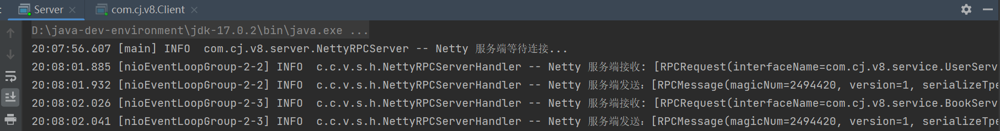

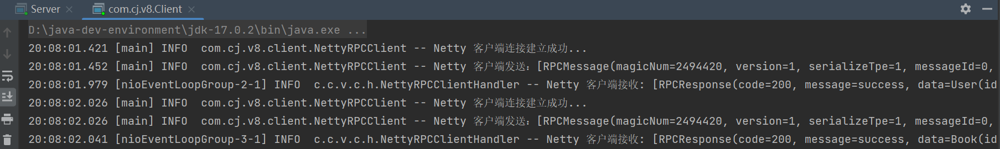

缺点：

- 客户端（服务消费者）与服务端（服务提供者）进行了绑定，也就是客户端必须提前知道服务端的主机和端口号，一旦服务端发生意外故障就需要客户端手动修改服务端的主机和端口号去寻找新的服务端提供服务，这是非常麻烦的。为此我们需要一个服务中心，为每个服务端发布（注册）的服务提供统一的管理，客户端只需向服务中心请求服务即可，而无需了解服务的来源，实现服务消费者和服务提供者之间的解耦。

### v9 版本【提供 Zookeeper 注册中心注册服务】

背景：服务注册中心，例如 Zookeeper、Eureka、Consul、Nacos 等

说明：

通过服务注册中心，我们可以管理多个服务提供者，服务注册中心通过注册服务提供者，为每个连接的服务消费者提供统一的服务列表，方便服务消费者发现和调用需要的服务。

图示：

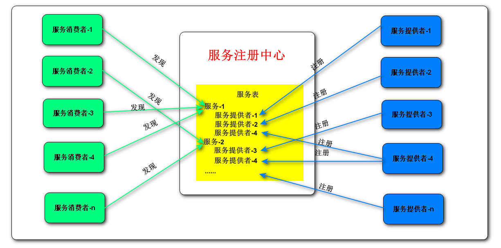

Zookeeper 应用：

1. 快速入门：[千锋最新Zookeeper集群教程-全网最全Zookeeper应用及原理分析课程_哔哩哔哩_bilibili](https://www.bilibili.com/video/BV1Ph411n7Ep/?spm_id_from=333.337.search-card.all.click)

2. 下载安装：[Apache ZooKeeper](https://zookeeper.apache.org/releases.html)

3. 配置参数：复制 `zoo_sample.cfg` 文件，并重命名为 `zoo.cfg` ，配置以下关键参数即可（windows）

   ```java
   dataDir=D:\\\\code-dev\\\\apache-zookeeper-3.7.1-bin\\\\data
   dataLogDir=D:\\\\code-dev\\\\apache-zookeeper-3.7.1-bin\\\\log
   ```

   这是由于 bin 目录下的脚本文件默认配置是 zoo.cfg，我们可以对其进行修改，或者也可以默认配置并修改 zoo_sample.cfg 命名为 zoo.cfg。

4. 启动服务：进入 bin 目录，输入 `zkServer.cmd`

5. 项目依赖：配置客户端依赖 [Apache Curator –](https://curator.apache.org/)

   ```xml
   <!-- <https://mvnrepository.com/artifact/org.apache.curator/curator-recipes> -->
   <dependency>
       <groupId>org.apache.curator</groupId>
       <artifactId>curator-recipes</artifactId>
       <version>5.5.0</version>
   </dependency>
   ```

实现过程：

- （1）新增 `ServiceRegistry` 服务注册中心接口

  ```java
  public interface ServiceRegistry {
      // 功能一：服务注册
      void registerService(String serviceName, InetSocketAddress serverAddress);
      // 功能二：服务发现
      InetSocketAddress discoverService(String serviceName);
  }
  ```

- （2）新增 `ZkServiceRegistry` 服务注册中心实现类

  ```java
  public class ZkServiceRegistry implements ServiceRegistry {
      // Zookeeper 的客户端 curator
      private CuratorFramework curator;
      // Zookeeper 的根目录 "quick-rpc"
      private static final String ROOT_PATH = "quick-rpc";
      // Zookeeper 的集群地址（目前只搭建一个）
      private static final String CLUSTER_ADDRESS = "127.0.0.1:2181";
  
      private static final Logger logger = LoggerFactory.getLogger(ZkServiceRegistry.class);
  
      // Zookeeper 的配置
      public ZkServiceRegistry() {
          this.curator = CuratorFrameworkFactory.builder()
                  .connectString(CLUSTER_ADDRESS)
                  .sessionTimeoutMs(40000)
                  .retryPolicy(new ExponentialBackoffRetry(1000, 3))
                  .namespace(ROOT_PATH)
                  .build();
          this.curator.start();
          logger.info("Zookeeper 连接成功: {}", curator);
      }
  
      @Override
      public void registerService(String serviceName, InetSocketAddress serverAddress) {
          // 服务名称路径
          String serviceNamePath = "/" + serviceName;
          // 服务提供者路径
          String serviceProviderPath = serviceNamePath + "/" + ServiceUtil.getServerAddress(serverAddress);
          try {
              // 1. 为服务创建永久节点，方便后续服务提供者时无需再建服务
              if (curator.checkExists().forPath(serviceNamePath) == null) {
                  curator.create().creatingParentsIfNeeded().withMode(CreateMode.PERSISTENT).forPath(serviceNamePath);
              }
              // 2. 为服务提供者创建临时节点，方便服务提供者故障时下线处理
              curator.create().creatingParentsIfNeeded().withMode(CreateMode.EPHEMERAL).forPath(serviceProviderPath);
              logger.info("注册服务: {}:{}", serviceName, serverAddress);
          } catch (Exception e) {
              logger.info("服务已存在: {}", e.getMessage());
          }
      }
  
      @Override
      public InetSocketAddress discoverService(String serviceName) {
          try {
  						List<String> servicePaths = curator.getChildren().forPath("/" + serviceName);
              // 默认采用第一个
              InetSocketAddress serverAddress = ServiceUtil.getServerAddress(servicePaths.get(0));
              logger.info("发现服务: {}:{}", serviceName, serverAddress);
              return serverAddress;
          } catch (Exception e) {
              e.printStackTrace();
              return null;
          }
      }
  }
  ```

- （3）重构 `ServiceProvider` 服务提供者接口，新增一个发布服务的方法

  ```java
  void pubService(String serviceName);
  ```

- （4）重构 `DefaultServiceProvider` 服务提供者，绑定服务注册中心，实现发布服务方法

  ```java
  public class DefaultServiceProvider implements ServiceProvider {
      private final Map<String, Object> services;
      private final ServiceRegistry serviceRegistry;
      private final String host;
      private final int port;
      public DefaultServiceProvider(String host, int port, ServiceRegistry serviceRegistry) {
          this.services = new HashMap<>();
          this.serviceRegistry = serviceRegistry;
          this.host = host;
          this.port = port;
      }
  
      @Override
      public void addService(String serviceName, Object service) {
          services.put(serviceName, service);
      }
  
      @Override
      public Object getService(String serviceName) {
          return services.get(serviceName);
      }
  
      @Override
      public void delService(String serviceName) {
          services.remove(serviceName);
      }
  
      @Override
      public void pubService(String serviceName) {
          serviceRegistry.registerService(serviceName, new InetSocketAddress(host, port));
      }
  }
  ```

- （5）重构 `AbstractRPCClient` 客户端，绑定服务注册中心

  ```java
  private ServiceRegistry serviceRegistry;
  ```

- （6）重构 `DefaultRPCClient` 客户端的发布请求方法

  ```java
  public class DefaultRPCClient extends AbstractRPCClient {
      private static final Logger logger = LoggerFactory.getLogger(DefaultRPCClient.class);
  
      **public DefaultRPCClient(ServiceRegistry serviceRegistry) {
          super(serviceRegistry);
      }**
  
      @Override
      public RPCResponse sendRPCRequest(RPCRequest request) {
          **InetSocketAddress address = getServiceRegistry().discoverService(request.getInterfaceName());
          String host = address.getHostName();
          int port = address.getPort();**
  
          try {
              **// 连接服务器**
  						**Socket socket = new Socket(host, port);
              logger.info("默认客户端连接服务: {}:{}", host, port);**
  
              if (socket.isConnected()) {
                  // 得到 IO 流
                  ObjectOutputStream objectOutputStream = new ObjectOutputStream(socket.getOutputStream());
                  ObjectInputStream objectInputStream = new ObjectInputStream(socket.getInputStream());
  
                  // 传入请求
                  objectOutputStream.writeObject(request);
                  objectOutputStream.flush();
                  // 得到数据
                  RPCResponse response = (RPCResponse) objectInputStream.readObject();
                  logger.info("客户端收到：{}", response);
  
                  // 关闭 IO 流
                  objectInputStream.close();
                  objectOutputStream.close();
  
                  // 返回请求
                  return response;
              }
              // 关闭连接
              socket.close();
          } catch (IOException | ClassNotFoundException e) {
              throw new RuntimeException(e);
          }
          return null;
      }
  }
  ```

- （7）重构 `NettyRPCClient` 客户端的请求方法

  ```java
  public class NettyRPCClient extends AbstractRPCClient {
      private static final Logger logger = LoggerFactory.getLogger(NettyRPCClient.class);
  
      **public NettyRPCClient(ServiceRegistry serviceRegistry) {
          super(serviceRegistry);
      }**
      @Override
      public RPCResponse sendRPCRequest(RPCRequest request) {
          **InetSocketAddress address = getServiceRegistry().discoverService(request.getInterfaceName());
          String host = address.getHostName();
          int port = address.getPort();**
  
          CompletableFuture<RPCResponse> completableFuture = new CompletableFuture<>();
          ChannelFuture channelFuture = new Bootstrap()
                  .group(new NioEventLoopGroup())
                  .channel(NioSocketChannel.class)
                  .handler(new ChannelInitializer<NioSocketChannel>() {
                      @Override
                      protected void initChannel(NioSocketChannel nioSocketChannel) throws Exception {
                          // 解码器
                          nioSocketChannel.pipeline().addLast(new RPCDecoder());
                          // 入站处理器
                          nioSocketChannel.pipeline().addLast(new NettyRPCClientHandler(completableFuture));
                          // 编码器
                          nioSocketChannel.pipeline().addLast(new RPCEncoder());
                      }
                  })
                  **.connect(new InetSocketAddress(host, port));**
          try {
              // 同步阻塞，直到连接建立完成发送结果
              channelFuture.sync();
  						**logger.info("Netty 客户端连接服务: {}:{}", host, port);**
  
              Channel channel = channelFuture.channel();
              // 构造发送数据
              RPCMessage rpcMessage = RPCMessage.builder()
                      .magicNum(RPCConstant.MESSAGE_MAGIC_NUM)
                      .version(RPCConstant.MESSAGE_VERSION)
                      .messageType(RPCConstant.MESSAGE_TYPE_REQUEST)
                      .serializeTpe(RPCConstant.MESSAGE_SERIALIZE_KRYO)
                      .data(request)
                      .build();
  
              channel.writeAndFlush(rpcMessage);
              logger.info("Netty 客户端发送：[{}]", rpcMessage);
              // 异步获取处理结果
              return completableFuture.get();
          } catch (InterruptedException | ExecutionException e) {
              throw new RuntimeException(e);
          }
      }
  }
  ```

- （8）修改 `Client` ，使客户端绑定注册中心

  ```java
  public class Client {
      public static void main(String[] args) {
          **AbstractRPCClient abstractRpcClient = new NettyRPCClient(new ZkServiceRegistry());**
          // 生成客户端代理类
          RPCClientProxy rpcClientProxy = new RPCClientProxy(abstractRpcClient);
  
          // 代理 user 服务
          UserService userService = rpcClientProxy.getProxyService(UserService.class);
          User user = userService.getUser("1");
  
          // 代理 book 服务
          BookService bookService = rpcClientProxy.getProxyService(BookService.class);
          Book book = bookService.getBook("1");
      }
  }
  ```

- （9）修改 `Server` ，使服务端绑定注册中心

  ```java
  public class Server {
      public static void main(String[] args) throws UnknownHostException {
          // 注册服务
          UserService userService = new UserServiceImpl();
          BookService bookService = new BookServiceImpl();
          **// 添加服务**
          **ServiceProvider serviceProvider = new DefaultServiceProvider(
                  InetAddress.getLocalHost().getHostAddress(),
                  8888,
                  new ZkServiceRegistry());**
          serviceProvider.addService(userService.getClass().getInterfaces()[0].getName(), userService);
          serviceProvider.addService(bookService.getClass().getInterfaces()[0].getName(), bookService);
          **// 发布服务
          serviceProvider.pubService(userService.getClass().getInterfaces()[0].getName());
          serviceProvider.pubService(bookService.getClass().getInterfaces()[0].getName());**
          // 测试服务
          AbstractRPCServer abstractRpcServer = new NettyRPCServer(8888, serviceProvider);
          abstractRpcServer.startServer();
      }
  }
  ```

**效果：**

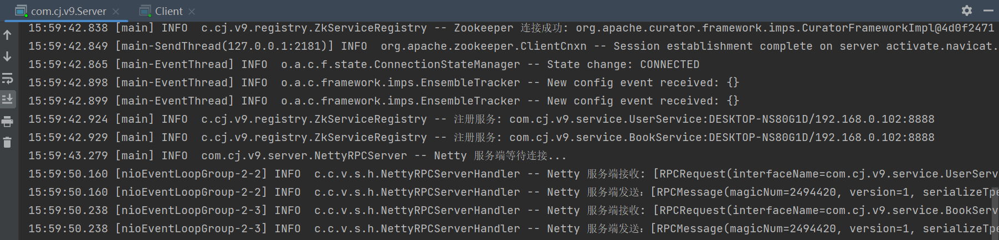

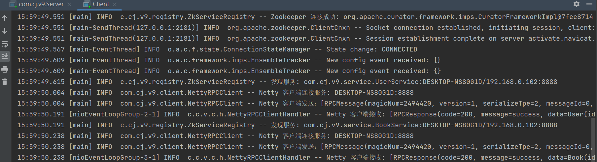

**缺点：**

- 我们在提供服务时，总是选取服务的第一个提供者来提供服务，对第一个服务提供者压力很大，因此很有必要设计合理的负载均衡算法。

  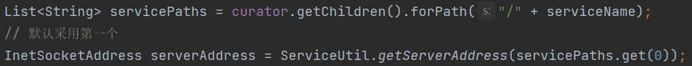

### v10 版本【支持多种负载均衡算法】

前置：

- 负载均衡算法
- 一致性哈希算法

说明：为了分散服务的第一个提供者的压力，我们提供一些负载均衡算法来实现。

实现：

- （1）重构 `ServiceRegistry` 服务注册中心的发现服务方法，使其接收 RPCRequest 参数，以便实现更多负载均衡算法

  ```java
  InetSocketAddress discoverService(RPCRequest request);
  ```

- （2）重构 `ZkServiceRegistry` 服务注册中心的发现服务方法，使其接收 RPCRequest 参数

  ```java
  @Override
  public InetSocketAddress discoverService(RPCRequest request) {
      String serviceName = request.getInterfaceName();
      try {
          List<String> strings = curator.getChildren().forPath("/" + serviceName);
          // 默认采用第一个
          InetSocketAddress serverAddress = ServiceUtil.getServerAddress(strings.get(0));
          logger.info("发现服务: {}:{}", serviceName, serverAddress);
          return serverAddress;
      } catch (Exception e) {
          e.printStackTrace();
          return null;
      }
  }
  ```

- （3）新增 `LoadBalance` 负载均衡算法接口

  ```java
  public interface LoadBalance {
      // 得到服务路径
      String getServicePath(List<String> servicePaths, RPCRequest request);
  }
  ```

- （4）新增 `RandomLoadBalance` 随机法实现类

  ```java
  public class RandomLoadBalance implements LoadBalance {
      private static final Random random = new Random();
      private static final Logger logger = LoggerFactory.getLogger(IpHashLoadBalance.class);
      @Override
      public String getServicePath(List<String> servicePaths, RPCRequest request) {
          String servicePath = servicePaths.get(random.nextInt(servicePaths.size()));
          logger.info("随机法结果: {}", servicePath);
          return servicePath;
      }
  }
  ```

- （5）新增 `RoundLoadBalance` 轮询法实现类

  ```java
  public class RoundLoadBalance implements LoadBalance {
      // 使用原子类保证并发安全
      private final AtomicInteger index = new AtomicInteger(-1);
      private static final Logger logger = LoggerFactory.getLogger(IpHashLoadBalance.class);
  
      @Override
      public String getServicePath(List<String> servicePaths, RPCRequest request) {
          String servicePath = servicePaths.get(index.incrementAndGet() % servicePaths.size());
          logger.info("轮询法结果: {}", servicePath);
          return servicePath;
      }
  }
  ```

- （6）重构 `RPCRequest` 请求，添加一个请求方地址，以便实现 ip-hash 算法

  ```java
  // 请求方的 ip
  private String ip;
  ```

- （7）重构 `RPCClientProxy`，添加客户端 ip

  ```java
  @Override
  public Object invoke(Object proxy, Method method, Object[] args) throws Throwable {
      // 构建请求
      RPCRequest request = RPCRequest.builder()
              .interfaceName(method.getDeclaringClass().getName())
              .methodName(method.getName())
              .args(args)
              .argsTypes(method.getParameterTypes())
              **.ip(InetAddress.getLocalHost().getHostAddress())**
              .build();
      // 发送请求
      RPCResponse response = abstractRpcClient.sendRPCRequest(request);
      // 返回数据
      return response.getData();
  }
  ```

- （8）新增 `IpHashLoadBalance` IP 哈希算法

  ```java
  public class IpHashLoadBalance implements LoadBalance {
      private static final Logger logger = LoggerFactory.getLogger(IpHashLoadBalance.class);
      @Override
      public String getServicePath(List<String> servicePaths, RPCRequest request) {
          String ip = request.getIp();
          String[] ipParts = ip.split("\\\\.");
          int ipInt =  (131 * (Integer.parseInt(ipParts[0]) & 0xFF)
                  + 137 * ((Integer.parseInt(ipParts[1]) >> 8) & 0xFF)
                  + 139 * ((Integer.parseInt(ipParts[2]) >> 16) & 0xFF)
                  + 149 * ((Integer.parseInt(ipParts[3]) >> 24) & 0xFF));
          String servicePath = servicePaths.get(ipInt % servicePaths.size());
          logger.info("IpHash 法结果: {}", servicePath);
          return servicePath;
      }
  }
  ```

- （9）重构 `ZkServiceRegistry` ，新增负载均衡算法作为属性

  ```java
  // 负载均衡算法
  private LoadBalance loadBalance;
  
  public ZkServiceRegistry(**LoadBalance loadBalance**) {
      this.curator = CuratorFrameworkFactory.builder()
              .connectString(CLUSTER_ADDRESS)
              .sessionTimeoutMs(40000)
              .retryPolicy(new ExponentialBackoffRetry(1000, 3))
              .namespace(ROOT_PATH)
              .build();
      this.curator.start();
      **this.loadBalance = loadBalance;**
      logger.info("Zookeeper 连接成功: {}", curator);
  }
  
  @Override
  public InetSocketAddress discoverService(RPCRequest request) {
      String serviceName = request.getInterfaceName();
      try {
          List<String> servicePaths = curator.getChildren().forPath("/" + serviceName);
          **// 采用负载均衡算法
          String servicePath = loadBalance.getServicePath(servicePaths, request);
          InetSocketAddress serverAddress = ServiceUtil.getServerAddress(servicePath);**
          logger.info("发现服务: {}:{}", serviceName, serverAddress);
          return serverAddress;
      } catch (Exception e) {
          e.printStackTrace();
          return null;
      }
  }
  ```

- （10）重构 `Client`，带上 `ServiceRegistry` 参数

  ```java
  public class Client {
      public static void main(String[] args) {
          AbstractRPCClient abstractRpcClient = new NettyRPCClient(new ZkServiceRegistry(new RandomLoadBalance()));
          // 生成客户端代理类
          RPCClientProxy rpcClientProxy = new RPCClientProxy(abstractRpcClient);
  
          // 代理 user 服务
          UserService userService = rpcClientProxy.getProxyService(UserService.class);
          User user = userService.getUser("1");
  
          // 代理 book 服务
          BookService bookService = rpcClientProxy.getProxyService(BookService.class);
          Book book = bookService.getBook("1");
      }
  }
  ```

- （11）重构 `Server`，带上 `ServiceRegistry` 参数

  ```java
  public class Server {
      private static final int port = 8888;
      public static void main(String[] args) throws UnknownHostException {
          // 注册服务
          UserService userService = new UserServiceImpl();
          BookService bookService = new BookServiceImpl();
          // 添加服务
          ServiceProvider serviceProvider = new DefaultServiceProvider(
                  InetAddress.getLocalHost().getHostAddress(),
                  port,
                  new ZkServiceRegistry(new RandomLoadBalance()));
          serviceProvider.addService(userService.getClass().getInterfaces()[0].getName(), userService);
          serviceProvider.addService(bookService.getClass().getInterfaces()[0].getName(), bookService);
          // 发布服务
          serviceProvider.pubService(userService.getClass().getInterfaces()[0].getName());
          serviceProvider.pubService(bookService.getClass().getInterfaces()[0].getName());
          // 测试服务
          AbstractRPCServer abstractRpcServer = new NettyRPCServer(port, serviceProvider);
          abstractRpcServer.startServer();
      }
  }
  ```

测试之前，拷贝几个 Server，改变端口号即可运行

```java
private static final int port = 8888;
private static final int port = 8889;
private static final int port = 8890;
```

**效果 1：随机法**

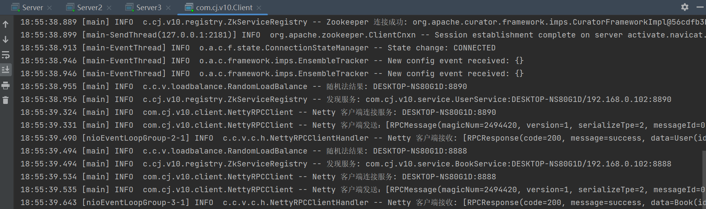

关闭全部后等待一段时间重启，可以吃个饭再来肝…

**效果 2：轮询法**

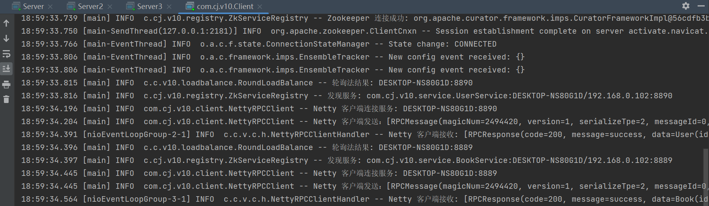

结果从大到小排列，这是因为 `curator.getChildren().forPath("/" + serviceName);` 得到的结果由 ZooKeeper 而定。

**效果 3：IP 哈希法**

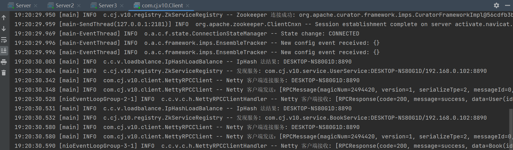

**缺点：**

- 模块间产生了耦合度，客户端与注册服务毫无关联，服务端与发现服务毫无关联。

### v11 版本【优化代码结构】

说明：一个重构之前代码的版本。

实现：

- （1）修订序列化方式常量的存放位置，`RPCConstant` ⇒ `Serializer`

  ```java
  public interface Serializer {
  
      byte SERIALIZER_JAVA = 0;
      byte SERIALIZER_JSON = 1;
      byte SERIALIZER_KRYO = 2;
  
      // 序列化方法：把对象转成字节数组
      <T> byte[] serialize(T object);
      // 反序列化方法：把字节数组转成对象
      <T> T deserialize(Class<T> clazz, byte[] bytes);
  }
  ```

- （2）修订部分命名，BIO ⇒ Bio、RPC ⇒ Rpc、Jdk ⇒ Java

- （3）重构拆分服务注册中心 `ServiceRegistry` 及 `ZkServiceRegistry` ，修正为 `ServiceDiscovery` 及 `ZkServiceDiscovery` 、`ServiceRegistration` 及 `ZkServiceRegistration`

- （4）修正包名结构

### v12 版本【增加心跳机制、断开重连机制保证连接安全】

说明：引入心跳机制是为了解决连接假死现象。

**连接假死现象**：通信过程中看起来双方都是正常连接，但是其中一方由于某些原因而无法正常通信，此时正常情况下应该断开连接（死亡），但是由于某些原因没有真正断开（假死），另一方也没有发现，导致另外一方继续等待，浪费资源。

出现连接假死的原因有很多种：

- 网络故障：由于网络原因，例如网络信号极差，此时数据的传输会出现丢包问题，无法进行正常数据通信。
- 设备故障：由于设备原因，例如网卡故障，导致底层的链路层已经无法正常工作，而应用层程序没有感觉到，从而无法进行正常数据通信。
- 应用故障：由于应用原因，例如开启的应用过多，处理器无法处理，导致应用程序被阻塞，无法进行数据的读写，从而无法进行正常的数据通信。

解决连接假死问题的广泛应用手段是心跳机制了。

**心跳机制**：处于网络通信的双方，其中一方定时发送数据包（ping 心跳包）给另外一方，另外一方如果能及时接收并返回响应（pong 心跳包），说明连接正常（正常心跳），如果另外一方无法及时接收，说明连接异常（心跳停止）。

Netty 为我们提供了一个 `IdleStateHandler` 类，这个类可以实现心跳机制，它接收三个操作时间，如果达到这三个时间，就会触发相应的事件：

- 读空闲时间 `readerIdleTime`：当前服务端或客户端读操作达到的最大空闲时间。
- 写空闲时间 `writerIdleTime`：当前服务端或客户端写操作达到的最大空闲时间。
- 读写空闲时间 `allIdleTime`：当前服务端或客户端读操作或写操作达到最大的空闲时间。

例如下面这个官方代码给出的例子：

```java
ch.pipeline().addLast(new IdleStateHandler(0, 0, 60)); // 三个值分别对应读空闲时间、写空闲时间、读写空闲时间，单位秒 
ch.pipeline().addLast(new ChannelDuplexHandler() {     // 注意 0 代表不做时间要求
    @Override  
    public void userEventTriggered(ChannelHandlerContext ctx, Object evt) throws Exception {  
        if (evt instanceof IdleStateEvent) {
            IdleStateEvent e = (IdleStateEvent) evt;
            if (e.state() == IdleState.READER_IDLE) {
                ctx.close();
            } else if (e.state() == IdleState.WRITER_IDLE) {
                ctx.writeAndFlush(new PingMessage());
            }
        }
    }  
});
```

在这个示例中，如果管道中达到了 60 秒没有进行读或者没有进行写操作，那么就会触发 userEventTriggered 事件了，从中捕捉对应的事件，从而触发对应的操作。

心跳机制可以及时检测通信双方的状态，对于服务端来说，客户端发送心跳超时被视为连接异常，直接关闭客户端连接即可。但是对于客户端来说，服务端连接相比较客户端连接更加稳定，如果连接失败（客户端接收 pong 超时或服务端偶然断开连接），需要添加的额外断开重连机制来完成。

**断开重连**：

1. 如果客户端在指定时间例如 60 秒都没有受到 pong 响应，那么认为此时服务端可能出现意外，需要进行断开重连，每过 30s 进行一次重连，如果超过 5 次都没连接成功，那么认为连接异常，不再重新连接。
2. 如果客户端连接过程中 channel 关闭了，也认为需要进行一定次数连接，确保不是偶然错误。

**实现**：增加心跳机制 + 断线重连。

- （1）新增 `RpcPing` 类表示客户端发送的心跳包

  ```java
  @Data
  public class RpcPing {
      private final String message;
  
      public RpcPing() {
          try {
              message = "ping: " + InetAddress.getLocalHost().getHostAddress();
          } catch (UnknownHostException e) {
              throw new RuntimeException(e);
          }
      }
  }
  ```

- （2）新增 `RpcPong` 类表示服务端发送的响应包

  ```java
  @Data
  public class RpcPong {
      private final String message;
  
      public RpcPong() {
          try {
              message = "pong: " + InetAddress.getLocalHost().getHostAddress();
          } catch (UnknownHostException e) {
              throw new RuntimeException(e);
          }
      }
  }
  ```

- （3）重构 `RpcConstant` ，添加一个 RpcHeartbeat 类型的消息号

  ```java
  byte MESSAGE_TYPE_PING = 2;
  byte MESSAGE_TYPE_PONG = 3;
  ```

- （4）重构 `MessageUtil`，新增一个表示 RpcHeartbeat 的消息类型

  ```java
  public class MessageUtil {
  
      public static Class getMessage(byte messageType) {
          switch (messageType) {
              case 0:
                  return RpcRequest.class;
              case 1:
                  return RpcResponse.class;
              **case 2:
                  return RpcPing.class;
              case 3:
                  return RpcPong.class;**
              default:
                  return null;
          }
      }
  }
  ```

- （5）新增 `RpcHeartbeatTrigger` ，用于客户端超过写空闲时间时发送心跳包

  ```java
  public class RpcHeartbeatTrigger extends SimpleChannelInboundHandler<RpcPong> {
      private static final Logger logger = LoggerFactory.getLogger(RpcHeartbeatTrigger.class);
      private final AtomicInteger totalRetry = new AtomicInteger(0);
      private static final int MAX_RETRY = 5;
      private final NettyRpcClient client;
  
      public RpcHeartbeatTrigger(NettyRpcClient client) {
          this.totalRetry.set(0);
          this.client = client;
      }
  
      @Override
      protected void channelRead0(ChannelHandlerContext channelHandlerContext, RpcPong rpcPong) throws Exception {
          logger.info("客户端响应 pong: {}", rpcPong);
      }
  
      @Override
      public void userEventTriggered(ChannelHandlerContext ctx, Object evt) {
          if (evt instanceof IdleStateEvent) {
              IdleStateEvent e = (IdleStateEvent) evt;
              if (e.state() == IdleState.WRITER_IDLE) {           // 发送心跳
                  handlerPing(ctx.channel());
              } else if (e.state() == IdleState.READER_IDLE) {    // 接收心跳不及时
                  handlerRetry(ctx.channel());
              }
          }
      }
  
      // 断开重连
      @Override
      public void channelInactive(ChannelHandlerContext ctx) {
          handlerRetry(ctx.channel());
      }
  
      // 心跳检测
      private void handlerPing(Channel channel) {
          RpcPing ping = new RpcPing();
          // 构造发送数据
          RpcMessage rpcMessage = RpcMessage.builder()
                  .magicNum(RpcConstant.MESSAGE_MAGIC_NUM)
                  .version(RpcConstant.MESSAGE_VERSION)
                  .messageType(RpcConstant.MESSAGE_TYPE_PING)
                  .serializeTpe(Serializer.SERIALIZER_KRYO)
                  .data(ping)
                  .build();
  
          channel.writeAndFlush(rpcMessage);
          logger.info("客户端发送 ping: [{}]", ping);
      }
  
      // 处理重试
      private void handlerRetry(Channel channel) {
          logger.info("连接服务端失败，即将进行重试: {}", channel);
          // 1. 删除原先的 channel
          InetSocketAddress inetSocketAddress = client.getChannelsHelper().get(channel);
          client.getChannels().remove(inetSocketAddress);
          client.getChannelsHelper().remove(channel);
          // 2. 关闭原先的 channel
          channel.close();
          // 3. 进行重试
          retryConnect(inetSocketAddress);
      }
  
      // 断线重试【每 30s 进行一次尝试连接，连接成功则正常连接，连接失败则重新尝试】
      // 1. 得到服务端的 channel, 将其删除并重试
      // 2. 重新尝试连接
      private void retryConnect(InetSocketAddress inetSocketAddress) {
          ChannelFuture channelFuture = client.getBootstrap().connect(inetSocketAddress);
          channelFuture.addListener((ChannelFutureListener) future -> {
              if (!future.isSuccess()) {                  // 5 次连接过程中失败
                  // 如果达到最大次数未连接上，那么不再连接
                  if (totalRetry.get() == MAX_RETRY) {
                      logger.info("达到最大次数，连接失败!");
                      return;
                  }
                  // 否则 30s 后交给后台线程重新连接
                  future.channel().eventLoop().schedule(() -> {
                      totalRetry.getAndIncrement();
                      logger.info("当前重试次数: {}", totalRetry.get());
                      retryConnect(inetSocketAddress);
                  }, 5, TimeUnit.SECONDS);
              } else {                                    // 5 次连接过程中成功
                  totalRetry.set(0);
                  Channel newChannel = future.channel();
                  client.getChannels().put(inetSocketAddress, newChannel);
                  client.getChannelsHelper().put(newChannel, inetSocketAddress);
                  logger.info("重试成功，连接成功!");
              }
          });
      }
  }
  ```

- （6）新增 `RpcHeartbeatHandler` ，用于服务端处理接收心跳包消息，以及处理心跳停止情况

  ```java
  public class RpcHeartbeatHandler extends SimpleChannelInboundHandler<RpcPing> {
  
      private static final Logger logger = LoggerFactory.getLogger(RpcHeartbeatHandler.class);
  
      // 心跳消息处理
      @Override
      protected void channelRead0(ChannelHandlerContext ctx, RpcPing rpcPing) throws Exception {
          // 处理心跳消息
          logger.info("服务端收到 ping: [{}]", rpcPing.getMessage());
          // 返回一个 pong
          RpcPong pong = new RpcPong();
          // 构造发送数据
          RpcMessage rpcMessage = RpcMessage.builder()
                  .magicNum(RpcConstant.MESSAGE_MAGIC_NUM)
                  .version(RpcConstant.MESSAGE_VERSION)
                  .messageType(RpcConstant.MESSAGE_TYPE_PONG)
                  .serializeTpe(Serializer.SERIALIZER_KRYO)
                  .data(pong)
                  .build();
  
          ctx.channel().writeAndFlush(rpcMessage);
          logger.info("服务端响应 pong: [{}]", pong);
      }
  
      // 心跳事件
      @Override
      public void userEventTriggered(ChannelHandlerContext ctx, Object evt) {
          if (evt instanceof IdleStateEvent) {
              IdleStateEvent e = (IdleStateEvent) evt;
              // 触发读空闲事件，说明对方出现问题，关闭通道
              if (e.state() == IdleState.READER_IDLE) {
                  logger.info("关闭通道: {}", ctx);
                  ctx.close();
              }
          }
      }
  }
  ```

- （7）重构 `NettyRpcServer` ，新增心跳处理，提示心跳消息处理器必须在解码器之后，否则无法解码获得心跳消息

  ```java
  @Override
  public void startServer() {
      new ServerBootstrap()
              .group(new NioEventLoopGroup())
              .channel(NioServerSocketChannel.class)
              .childHandler(new ChannelInitializer<NioSocketChannel>() {
                  @Override
                  protected void initChannel(NioSocketChannel nioSocketChannel) throws Exception {
                      **// 心跳检测
                      nioSocketChannel.pipeline().addLast(new IdleStateHandler(60, 0, 0));**
                      // 解码器
                      nioSocketChannel.pipeline().addLast(new RPCDecoder());
                      **// 心跳消息处理器（rpcHeartbeat）
                      nioSocketChannel.pipeline().addLast(new RpcHeartbeatHandler());**
                      // 请求消息处理器（rpcRequest）
                      nioSocketChannel.pipeline().addLast(new RpcRequestHandler(getServiceProvider()));
                      // 编码器
                      nioSocketChannel.pipeline().addLast(new RPCEncoder());
                  }
              })
              .bind(getServiceProvider().getPort());
      logger.info("Netty 服务端等待连接...");
  }
  ```

- （8）重构 `NettyRpcClient` ，新增心跳处理，并且重构代码，使得 Channel 能够复用，而不用每次发送请求创建一个新 Channel

  ```java
  @Data
  public class NettyRpcClient extends AbstractRpcClient {
      private static final Logger logger = LoggerFactory.getLogger(NettyRpcClient.class);
      private final Bootstrap bootstrap;
      private final Map<InetSocketAddress, Channel> channels;
      private final Map<Channel, InetSocketAddress> channelsHelper;
      private final RpcResponseHandler rpcResponseHandler;
      public NettyRpcClient() {
          super();
          this.rpcResponseHandler = new RpcResponseHandler();
          this.channels = new ConcurrentHashMap<>();
          this.channelsHelper = new ConcurrentHashMap<>();
          this.bootstrap = new Bootstrap()
                  .group(new NioEventLoopGroup())
                  .channel(NioSocketChannel.class)
                  .handler(new ChannelInitializer<NioSocketChannel>() {
                      @Override
                      protected void initChannel(NioSocketChannel nioSocketChannel) {
                          // 【心跳检测 + 断线重连】5s 达到写空闲，发送心跳 ping，60s 达到读空闲，断线重连
                          nioSocketChannel.pipeline().addLast(new IdleStateHandler(60, 5, 0));
                          // 解码器
                          nioSocketChannel.pipeline().addLast(new RPCDecoder());
                          // 心跳触发器
                          nioSocketChannel.pipeline().addLast(new RpcHeartbeatTrigger(NettyRpcClient.this));
                          // 入站处理器
                          nioSocketChannel.pipeline().addLast(rpcResponseHandler);
                          // 编码器
                          nioSocketChannel.pipeline().addLast(new RPCEncoder());
                      }
                  });
      }
  
      public Channel getChannel(InetSocketAddress inetSocketAddress) {
          // 如果对应服务的 channel 不存在，则连接获取 channel
          if (!channels.containsKey(inetSocketAddress)) {
              try {
                  Channel channel = bootstrap
                          .connect(inetSocketAddress)
                          .sync()
                          .channel();
                  channels.put(inetSocketAddress, channel);
                  channelsHelper.put(channel, inetSocketAddress);
                  logger.info("Netty 客户端连接服务: {}", inetSocketAddress);
              } catch (InterruptedException e) {
                  throw new RuntimeException(e);
              }
          }
          return channels.get(inetSocketAddress);
      }
  
      @Override
      public RpcResponse sendRPCRequest(RpcRequest request) {
          try {
              // 1. 异步结果
              CompletableFuture<RpcResponse> completableFuture = new CompletableFuture<>();
              rpcResponseHandler.setCompletableFuture(completableFuture);
              // 2. 寻找服务所对应的 channel
              InetSocketAddress address = getServiceDiscovery().discoverService(request);
              Channel channel = getChannel(address);
              // 3. 构造发送数据
              RpcMessage rpcMessage = RpcMessage.builder()
                      .magicNum(RpcConstant.MESSAGE_MAGIC_NUM)
                      .version(RpcConstant.MESSAGE_VERSION)
                      .messageType(RpcConstant.MESSAGE_TYPE_REQUEST)
                      .serializeTpe(Serializer.SERIALIZER_KRYO)
                      .data(request)
                      .build();
              channel.writeAndFlush(rpcMessage);
              logger.info("Netty 客户端发送：[{}]", rpcMessage);
              // 4. 接收异步调用结果
              return completableFuture.get();
          } catch (InterruptedException | ExecutionException e) {
              throw new RuntimeException(e);
          }
      }
  }
  ```

**效果**：

正常清空：

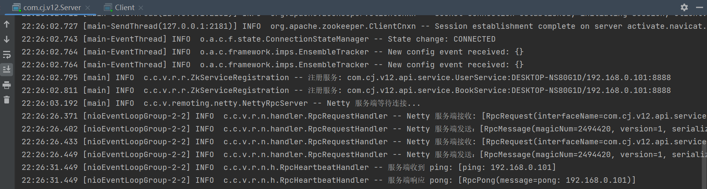

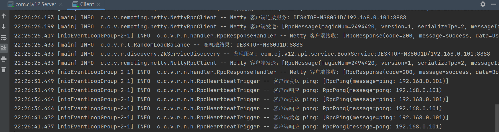

服务端断开：

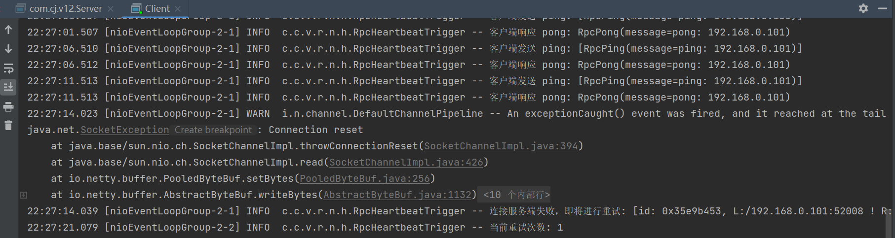

重启服务端：

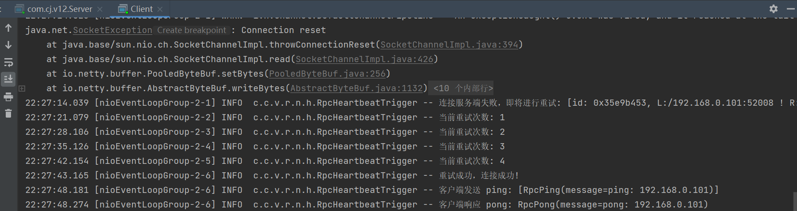

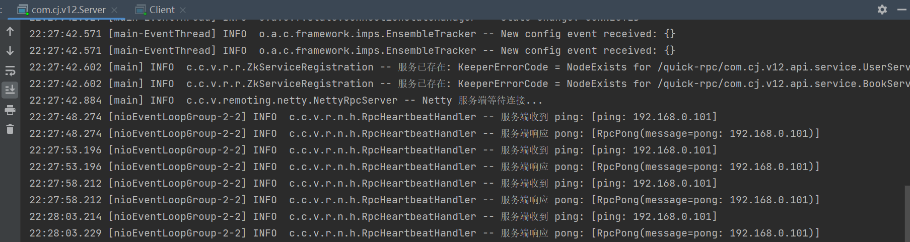

未完待续…

接下来的工作：

- [ ] 完成 Protobuf 跨语言支持协议
- [ ] 完成一致性负载均衡算法
- [ ] 处理一个接口具有多个实现类、一个实现类实现了多个接口的情况
- [ ] ……


